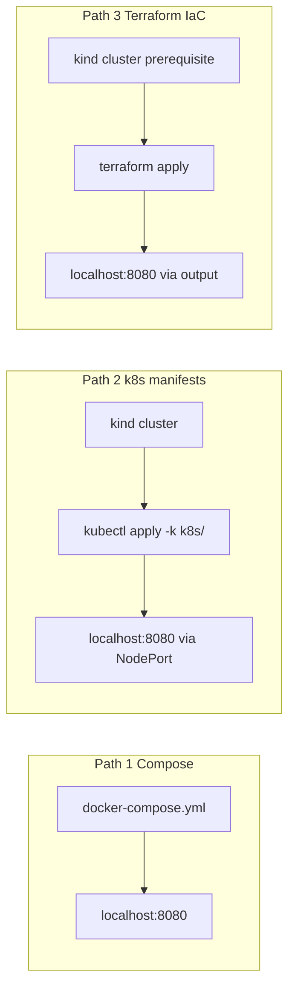

# Phase 3 Report - Cloud-Native Delivery + IaC + CI

## Deliverables checklist

| Deliverable | Location |
|-------------|----------|
| Git tag `v3-phase3-week14` | `git tag v3-phase3-week14 && git push origin v3-phase3-week14` |
| Deployment runbook | [DEPLOYMENT.md](../../DEPLOYMENT.md) |
| Dockerfile | [backend/Dockerfile](../../backend/Dockerfile) |
| Docker Compose stack | [docker-compose.yml](../../docker-compose.yml) |
| Kubernetes manifests | [k8s/](../../k8s/) |
| Terraform IaC | [terraform/main.tf](../../terraform/main.tf), [variables.tf](../../terraform/variables.tf), [outputs.tf](../../terraform/outputs.tf), [terraform.tfvars.example](../../terraform/terraform.tfvars.example), [README](../../terraform/README.md) |
| CI workflow | [.github/workflows/ci.yml](../../.github/workflows/ci.yml) |

---

## Deployment paths (overview)

WorkHub supports three deploy paths, increasing fidelity to production:



| Path | Purpose | Graded as |
|------|---------|-----------|
| Compose | Local dev, rubric section A | Docker + Compose |
| `k8s/` + kind | Manifest correctness, probes | Kubernetes |
| Terraform on kind | Track 2 IaC deliverable | Terraform (mandatory) |

**Deployment option chosen:** local Docker Compose (required) + local Kubernetes
via **kind** + **Terraform Kubernetes provider (Track 2)**. Render and Oracle
Cloud VM tracks were not used; Track 2 reuses the same Kubernetes resource
shape as the `k8s/` manifests and matches how production teams separate image
build (CI) from workload deploy (IaC).

Step-by-step commands for all paths: [DEPLOYMENT.md](../../DEPLOYMENT.md).

---

## A - Containers

**Rubric:** Docker + Compose end-to-end works (5 marks).

### What ships

**Multi-stage Dockerfile** - [backend/Dockerfile](../../backend/Dockerfile):

- **Stage 1 (builder):** `eclipse-temurin:25-jdk`, runs `./mvnw clean package`
  with tests skipped (image build is separate from CI test gate).
- **Stage 2 (runtime):** `eclipse-temurin:25-jre`, copies only `app.jar`, runs
  as non-root user `workhub` (uid `10001`).
- **HEALTHCHECK:** `wget` against `/actuator/health/liveness` every 30s with
  60s start period (JVM warm-up allowance).

**Docker Compose stack** - [docker-compose.yml](../../docker-compose.yml):

| Service | Image | Host port | Role |
|---------|-------|-----------|------|
| `postgres` | `postgres:16` | 5433 | Shared DB |
| `kafka` | `apache/kafka:3.7.0` | 9092 | KRaft broker (no Zookeeper) |
| `kafka-ui` | `provectuslabs/kafka-ui` | 8081 | Topic inspection (optional) |
| `backend` | built from `./backend` | 8080 | Spring Boot API |

Postgres uses a `pg_isready` healthcheck. The backend `depends_on` Postgres
with `condition: service_healthy` so Hibernate does not race the database on
cold start. Environment variables wire cluster-internal hostnames
(`postgres:5432`, `kafka:29092`) and dev secrets (`JWT_SECRET`, DB creds).

### Why it exists

- **Multi-stage build** keeps the runtime image free of Maven, JDK, and source -
  smaller attack surface and faster pulls.
- **Non-root user** is defense-in-depth; aligns with the same uid (`10001`) used
  in Kubernetes `securityContext`.
- **Compose health + depends_on** models how production orchestrators gate
  startup order without custom entrypoint scripts.
- **KRaft Kafka** satisfies Phase 2 messaging requirements with a single broker
  suitable for local and CI-like environments.

### What breaks if removed

| Change | Effect |
|--------|--------|
| Remove Postgres healthcheck / `depends_on` | Backend starts before DB is ready → connection failures, flaky first request |
| Run container as root | Violates security posture; mismatches K8s `runAsUser: 10001` |
| Single-stage image (JDK in prod) | Larger image, build tools in runtime, slower deploys |
| Remove HEALTHCHECK | `docker compose ps` cannot surface unhealthy JVM; harder to debug hangs |

### Verify

```bash
docker compose up -d --build
curl -s http://localhost:8080/actuator/health/readiness | jq
# Expect: {"status":"UP"}

curl -s -X POST http://localhost:8080/auth/login \
  -H "Content-Type: application/json" \
  -d '{"email":"admin@acme.com","password":"password123"}' | jq -r .token
# Expect: non-empty JWT

docker compose down -v
```

---

## B - Kubernetes

**Rubric:** Kubernetes manifests correct incl. probes/config (5 marks).

### What ships

Layout under [k8s/](../../k8s/):

```
k8s/
├── kind-config.yaml          # kind cluster: NodePort 30080 → host 8080
├── namespace.yaml            # workhub namespace
├── backend-configmap.yaml    # non-secret env (JDBC URL, Kafka, profile)
├── backend-secret.yaml       # SPRING_DATASOURCE_PASSWORD, JWT_SECRET
├── backend-deployment.yaml   # 2 replicas, Actuator probes, resource limits
├── backend-service.yaml      # NodePort 30080
├── kustomization.yaml        # backend app resources
└── infra/
    ├── postgres.yaml         # StatefulSet + headless Service + PVC
    └── kafka.yaml            # KRaft StatefulSet + headless Service
```

**Backend Deployment** - [k8s/backend-deployment.yaml](../../k8s/backend-deployment.yaml):

- `replicas: 2`, `RollingUpdate` with `maxSurge: 1`, `maxUnavailable: 0`
  (no downtime during rollout).
- `envFrom`: ConfigMap `backend-config` + Secret `backend-secret`.
- **readinessProbe:** `GET /actuator/health/readiness` on port `http`
  (initialDelay 20s).
- **livenessProbe:** `GET /actuator/health/liveness` on port `http`
  (initialDelay 60s).
- **securityContext:** `runAsNonRoot: true`, `runAsUser: 10001`,
  `capabilities.drop: ["ALL"]`.

**Service** - [k8s/backend-service.yaml](../../k8s/backend-service.yaml):
`NodePort` 30080 → container port `http` (8080).

**kind port mapping** - [k8s/kind-config.yaml](../../k8s/kind-config.yaml):
`extraPortMappings` maps container port 30080 to host `8080`, so
`curl http://localhost:8080` works without `kubectl port-forward`.

Actuator probe endpoints are enabled in
[backend/src/main/resources/application.yaml](../../backend/src/main/resources/application.yaml)
(`management.endpoint.health.probes.enabled: true`). See
[docs/phase2/OBSERVABILITY.md](../phase2/OBSERVABILITY.md) for the full
endpoint matrix.

### Why it exists

- **ConfigMap vs Secret** satisfies the rubric “Secrets pattern”: non-sensitive
  config (JDBC URL, Kafka bootstrap, Spring profile) stays in ConfigMap; DB
  password and JWT signing key stay in Secret.
- **Readiness probe** tells Kubernetes when the pod can receive traffic - avoids
  routing to a JVM still starting Flyway/Hibernate.
- **Liveness probe** restarts pods that are alive but stuck (deadlock, hung GC).
- **RollingUpdate maxUnavailable: 0** keeps at least one backend replica serving
  during image updates.
- **NodePort + kind mapping** gives graders and demos a stable host URL.

### What breaks if removed

| Change | Effect |
|--------|--------|
| No readiness probe | Service sends traffic before app is ready → 502/503 during rollout |
| No liveness probe | Hung JVM never restarted → silent outage |
| Merge Secret into ConfigMap | Secrets in plain manifests; rotation couples to config changes |
| No `maxUnavailable: 0` | Brief API unavailability on every deploy |

### Verify

Full apply sequence: [DEPLOYMENT.md - Path 2](../../DEPLOYMENT.md#path-2--kubernetes-manifests--kind-grading-section-b).

```bash
docker build -t workhub-backend:dev ./backend
kind create cluster --name workhub --config k8s/kind-config.yaml
kind load docker-image workhub-backend:dev --name workhub

kubectl apply -f k8s/namespace.yaml
kubectl apply -f k8s/backend-configmap.yaml -f k8s/backend-secret.yaml
kubectl apply -k k8s/infra/
kubectl -n workhub rollout status statefulset/postgres --timeout=180s
kubectl -n workhub rollout status statefulset/kafka --timeout=180s
kubectl apply -k k8s/
kubectl -n workhub rollout status deployment/backend --timeout=180s

curl -s http://localhost:8080/actuator/health | jq
# Expect: {"status":"UP"}

kind delete cluster --name workhub
```

---

## C - Terraform (Track 2: Kubernetes)

**Rubric:** Terraform IaC completeness + reproducibility (6 marks).

### What ships

[terraform/](../../terraform/) provisions Kubernetes resources into an
**existing** cluster (local: kind created from `k8s/kind-config.yaml`):

| Resource | Terraform resource | Mirrors |
|----------|-------------------|---------|
| Namespace `workhub` | `kubernetes_namespace.workhub` | `k8s/namespace.yaml` |
| Backend ConfigMap | `kubernetes_config_map.backend` | `k8s/backend-configmap.yaml` |
| Backend Secret | `kubernetes_secret.backend` | `k8s/backend-secret.yaml` |
| Postgres Service + StatefulSet | `kubernetes_service.postgres`, `kubernetes_stateful_set.postgres` | `k8s/infra/postgres.yaml` |
| Kafka Service + StatefulSet | `kubernetes_service.kafka`, `kubernetes_stateful_set.kafka` | `k8s/infra/kafka.yaml` |
| Backend Deployment | `kubernetes_deployment.backend` | `k8s/backend-deployment.yaml` |
| Backend NodePort Service | `kubernetes_service.backend` | `k8s/backend-service.yaml` |

Supporting files:

- [terraform/variables.tf](../../terraform/variables.tf) - typed inputs;
  `db_password` and `jwt_secret` marked `sensitive = true`.
- [terraform/outputs.tf](../../terraform/outputs.tf) - `backend_host_url`,
  `backend_nodeport`, `namespace_name`, kube context path.
- [terraform/terraform.tfvars.example](../../terraform/terraform.tfvars.example)
  - example values only (no production secrets committed).
- [terraform/README.md](../../terraform/README.md) - `init` / `plan` / `apply`
  / `destroy` runbook.

**Intentionally outside Terraform:**

- **kind cluster creation** - platform prerequisite (`kind create cluster`).
- **Docker image build** - CI or local `docker build` + `kind load docker-image`.

This matches enterprise practice: CI produces an immutable image tag; Terraform
deploys that tag. `wait_for_rollout = true` on Postgres and Kafka StatefulSets
blocks backend Deployment until dependencies are healthy.

### Why Track 2 + this shape

The project brief offers **VM track** (Terraform provisions VM + Compose on VM)
or **Kubernetes track** (Terraform provisions K8s resources). Track 2 was
chosen because Phase 3 already defines `k8s/` manifests; Terraform encodes the
same shape declaratively so `terraform plan` catches drift before apply.

**Why IaC prevents drift:** Manual `kubectl apply` without versioned Terraform
state means the next teammate cannot reproduce the cluster layout, secret names,
or probe timings. Terraform state + code review make infra changes auditable and
repeatable - the same reason teams forbid “click ops” in production.

### What breaks if removed

| Change | Effect |
|--------|--------|
| No Terraform (manual infra only) | **IaC Hard Gate** - Phase 3 max 50% |
| No `sensitive` on secrets | `terraform plan` may print passwords |
| No `outputs.tf` | No programmatic discovery of backend URL for scripts/CI |
| No `terraform.tfvars.example` | New operators lack a safe template |
| Terraform also builds images | Couples infra apply to build machine; breaks CI/CD separation |
| Apply `k8s/infra/` during Terraform path | Duplicate Postgres/Kafka resources, conflicting ownership |

### Verify

```bash
kind create cluster --name workhub --config k8s/kind-config.yaml
kubectl --context kind-workhub -n kube-system rollout status deployment/coredns --timeout=120s

docker build -t workhub-backend:dev ./backend
kind load docker-image workhub-backend:dev --name workhub

terraform -chdir=terraform init
terraform -chdir=terraform fmt -check
terraform -chdir=terraform validate
terraform -chdir=terraform apply -var-file=terraform.tfvars.example -auto-approve

curl -s "$(terraform -chdir=terraform output -raw backend_host_url)/actuator/health/readiness" | jq
# Expect: {"status":"UP"}

terraform -chdir=terraform destroy -var-file=terraform.tfvars.example -auto-approve
kind delete cluster --name workhub
```

Do **not** run `kubectl apply -k k8s/infra/` on the Terraform path; Postgres
and Kafka are Terraform-managed there. Raw `k8s/` manifests remain for Path 2
and rubric review.

---

## D - CI/CD

**Rubric:** CI pipeline runs build + tests + image build (4 marks).

### What ships

Workflow: [.github/workflows/ci.yml](../../.github/workflows/ci.yml)

| Job | Steps | Depends on |
|-----|-------|------------|
| `build-test` | Checkout → JDK 25 Temurin → `chmod +x mvnw` → `./mvnw -B verify` with Postgres 16 service container | - |
| `docker-build` | Buildx build `backend/Dockerfile`, tags `workhub-backend:$SHA` and `:dev`, GHA cache; **push: false** (rubric: optional) | `build-test` |
| `terraform-validate` | `terraform fmt -check` → `init -backend=false` → `validate` | - |

**Environment for tests** (`build-test` job):

- `SPRING_DATASOURCE_URL=jdbc:postgresql://localhost:5432/workhub`
- `SPRING_PROFILES_ACTIVE=ci`
- `JWT_SECRET` set for test signing

Kafka integration tests use **Testcontainers** inside Maven (see
[backend/pom.xml](../../backend/pom.xml)); Postgres uses the GitHub Actions
service container so existing `@SpringBootTest` tests connect without new test
code.

### Why it exists

- Phase 3 requires **build + tests + Docker image build** on every push/PR.
- Enterprise Testing **hard gate:** tests must run in CI or Phase 3 CI score = 0.
- **Postgres service container** (not Testcontainers for Postgres) reuses env
  externalisation from `application.yaml` - zero extra Maven dependencies.
- **`terraform-validate`** catches IaC formatting and syntax errors before merge.
- **`docker-build` after `build-test`** ensures images are only built when tests
  pass (fail fast).

### What breaks if removed

| Change | Effect |
|--------|--------|
| Remove `build-test` / skip `verify` | **CI hard gate** - Enterprise Testing score 0 for CI |
| Remove Postgres service | JDBC integration tests fail in CI |
| Remove `docker-build` | Rubric item “build Docker image” not met |
| Remove `terraform-validate` | IaC drift merges undetected |

### Verify

```bash
# Local equivalent of CI test job
cd backend && ./mvnw -B verify

# After push to main - GitHub CLI
gh run list --workflow=ci.yml --limit 5
gh run view <run-id> --log-failed
# Expect: build-test, docker-build, terraform-validate all success
```

Required integration tests (tenant isolation, RBAC, rollback, concurrency,
messaging, observability) are listed in the project brief and implemented under
`backend/src/test/java/com/workhub/backend/integration/`. They run as part of
`./mvnw verify` in CI.

---

## Enterprise testing ↔ Phase 3 CI

Phase 3 CI score is tied to whether integration tests execute in the pipeline:

| Test area | Marks | Example test class |
|-----------|-------|-------------------|
| Tenant isolation | 4 | `TenantIsolationIT` |
| RBAC | 3 | `RbacIT` |
| Transaction rollback | 2 | `TransactionRollbackIT` |
| Concurrency | 3 | `ConcurrencyIT` |
| Messaging reliability | 2 | `MessagingReliabilityIT` |
| Observability | 1 | `ObservabilityIT` |

If `build-test` does not run `./mvnw verify`, both Enterprise Testing and
Phase 3 CI are at risk. The workflow runs on `push` to `main`, `pull_request`
to `main`, and `workflow_dispatch`.

---